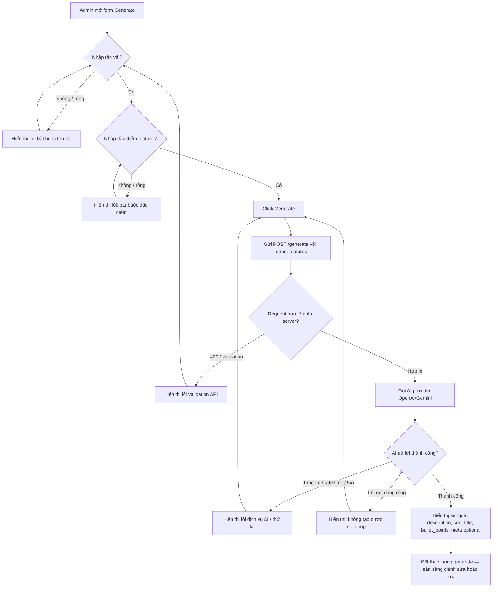

# 1.1 — AI Content Generation Flow

Feature: Backend AI Generator (PRD §4.1) — `POST /generate`

```mermaid
flowchart TD
    A[Admin mở form Generate] --> B{Nhập tên vải?}
    B -->|Không / rỗng| B1[Hiển thị lỗi: bắt buộc tên vải]
    B1 --> B
    B -->|Có| C{Nhập đặc điểm features?}
    C -->|Không / rỗng| C1[Hiển thị lỗi: bắt buộc đặc điểm]
    C1 --> C
    C -->|Có| D[Click Generate]
    D --> E[Gửi POST /generate với name, features]
    E --> F{Request hợp lệ phía server?}
    F -->|400 / validation| F1[Hiển thị lỗi validation API]
    F1 --> B
    F -->|Hợp lệ| G[Gọi AI provider OpenAI/Gemini]
    G --> H{AI trả lời thành công?}
    H -->|Timeout / rate limit / 5xx| H1[Hiển thị lỗi dịch vụ AI / thử lại]
    H1 --> D
    H -->|Lỗi nội dung rỗng| H2[Hiển thị: không tạo được nội dung]
    H2 --> D
    H -->|Thành công| I[Hiển thị kết quả: description, seo_title, bullet_points, meta optional]
    I --> J[Kết thúc luồng generate — sẵn sàng chỉnh sửa hoặc lưu]
```
