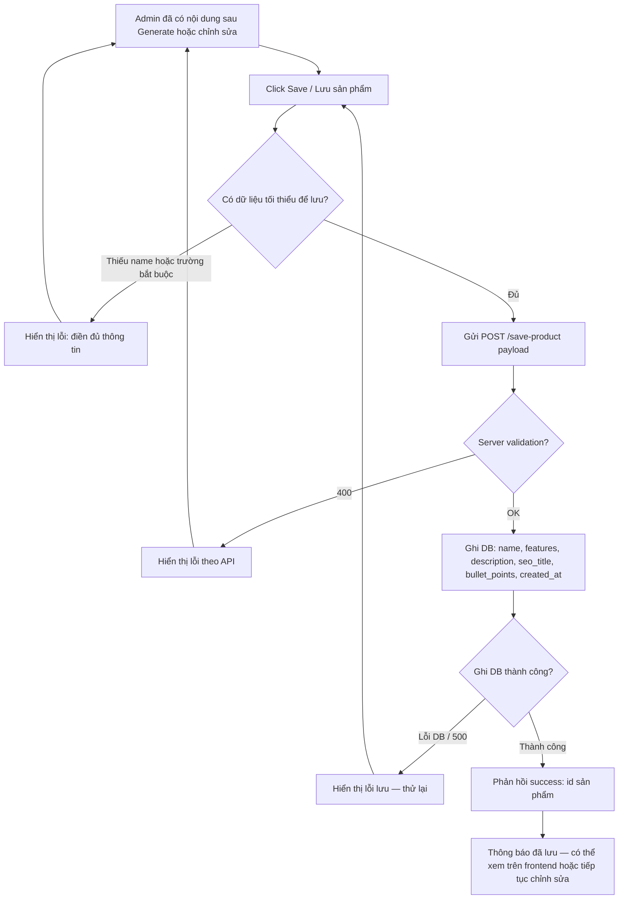

# 1.2 — Save Product (Database) Flow

Feature: Product persistence (PRD §4.2) — `POST /save-product`

```mermaid
flowchart TD
    A[Admin đã có nội dung sau Generate hoặc chỉnh sửa] --> B[Click Save / Lưu sản phẩm]
    B --> C{Có dữ liệu tối thiểu để lưu?}
    C -->|Thiếu name hoặc trường bắt buộc| C1[Hiển thị lỗi: điền đủ thông tin]
    C1 --> A
    C -->|Đủ| D[Gửi POST /save-product payload]
    D --> E{Server validation?}
    E -->|400| E1[Hiển thị lỗi theo API]
    E1 --> A
    E -->|OK| F[Ghi DB: name, features, description, seo_title, bullet_points, created_at]
    F --> G{Ghi DB thành công?}
    G -->|Lỗi DB / 500| G1[Hiển thị lỗi lưu — thử lại]
    G1 --> B
    G -->|Thành công| H[Phản hồi success: id sản phẩm]
    H --> I[Thông báo đã lưu — có thể xem trên frontend hoặc tiếp tục chỉnh sửa]
```
