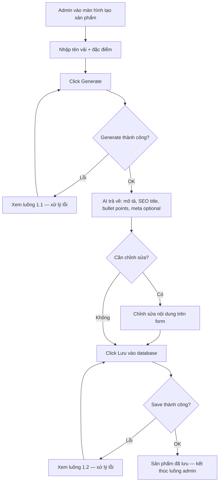

# 2.1 — Admin Product Creation (End-to-End) Flow

Feature: Admin User Flow (PRD §5 — Backend)

```mermaid
flowchart TD
    A[Admin vào màn hình tạo sản phẩm] --> B[Nhập tên vải + đặc điểm]
    B --> C[Click Generate]
    C --> D{Generate thành công?}
    D -->|Lỗi| D1[Xem luồng 1.1 — xử lý lỗi]
    D1 --> C
    D -->|OK| E[AI trả về: mô tả, SEO title, bullet points, meta optional]
    E --> F{Cần chỉnh sửa?}
    F -->|Có| G[Chỉnh sửa nội dung trên form]
    G --> H
    F -->|Không| H[Click Lưu vào database]
    H --> I{Save thành công?}
    I -->|Lỗi| I1[Xem luồng 1.2 — xử lý lỗi]
    I1 --> H
    I -->|OK| J[Sản phẩm đã lưu — kết thúc luồng admin]
```
