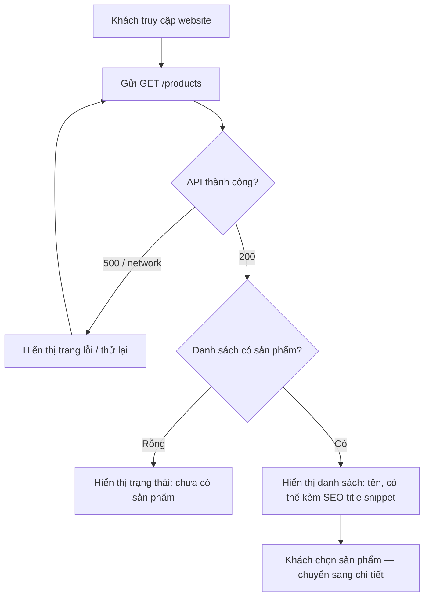

# 3.1 — Browse Products Flow

Feature: Frontend — xem danh sách (PRD §4.3, §5 Customer bước 1–2) — `GET /products`

```mermaid
flowchart TD
    A[Khách truy cập website] --> B[Gửi GET /products]
    B --> C{API thành công?}
    C -->|500 / network| C1[Hiển thị trang lỗi / thử lại]
    C1 --> B
    C -->|200| D{Danh sách có sản phẩm?}
    D -->|Rỗng| D1[Hiển thị trạng thái: chưa có sản phẩm]
    D -->|Có| E[Hiển thị danh sách: tên, có thể kèm SEO title snippet]
    E --> F[Khách chọn sản phẩm — chuyển sang chi tiết]
```
