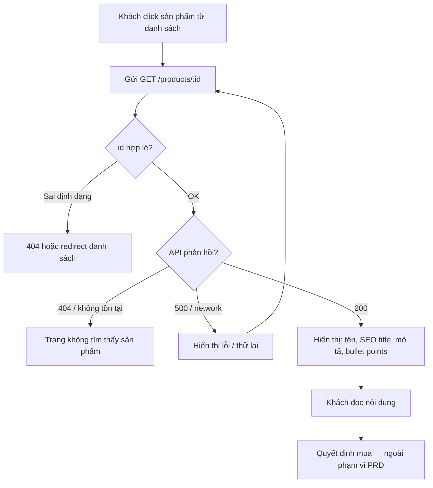

# 3.2 — Product Detail View Flow

Feature: Frontend — trang sản phẩm (PRD §4.3) — `GET /products/:id`

```mermaid
flowchart TD
    A[Khách click sản phẩm từ danh sách] --> B[Gửi GET /products/:id]
    B --> C{id hợp lệ?}
    C -->|Sai định dạng| C1[404 hoặc redirect danh sách]
    C -->|OK| D{API phản hồi?}
    D -->|404 / không tồn tại| D1[Trang không tìm thấy sản phẩm]
    D -->|500 / network| D2[Hiển thị lỗi / thử lại]
    D2 --> B
    D -->|200| E[Hiển thị: tên, SEO title, mô tả, bullet points]
    E --> F[Khách đọc nội dung]
    F --> G[Quyết định mua — ngoài phạm vi PRD]
```
