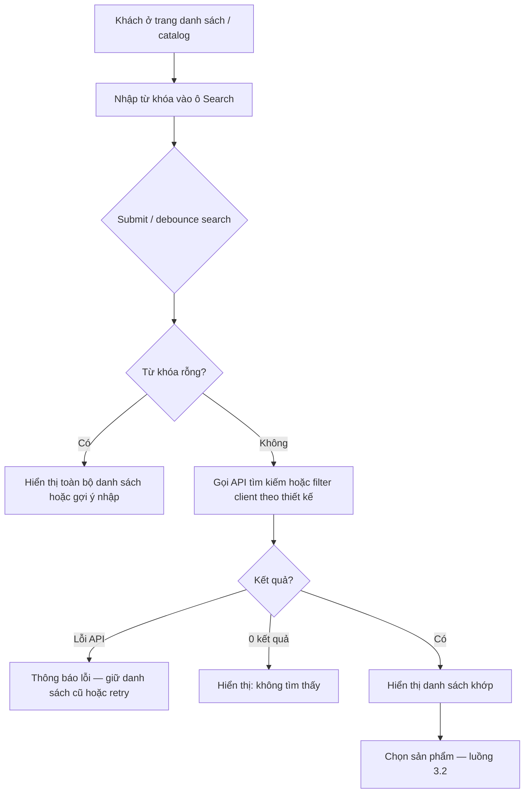

# 4.1 — Search Products Flow

Feature: Optional — Search sản phẩm (PRD §4.3)

```mermaid
flowchart TD
    A[Khách ở trang danh sách / catalog] --> B[Nhập từ khóa vào ô Search]
    B --> C{Submit / debounce search}
    C --> D{Từ khóa rỗng?}
    D -->|Có| E[Hiển thị toàn bộ danh sách hoặc gợi ý nhập]
    D -->|Không| F[Gọi API tìm kiếm hoặc filter client theo thiết kế]
    F --> G{Kết quả?}
    G -->|Lỗi API| G1[Thông báo lỗi — giữ danh sách cũ hoặc retry]
    G -->|0 kết quả| G2[Hiển thị: không tìm thấy]
    G -->|Có| H[Hiển thị danh sách khớp]
    H --> I[Chọn sản phẩm — luồng 3.2]
```
