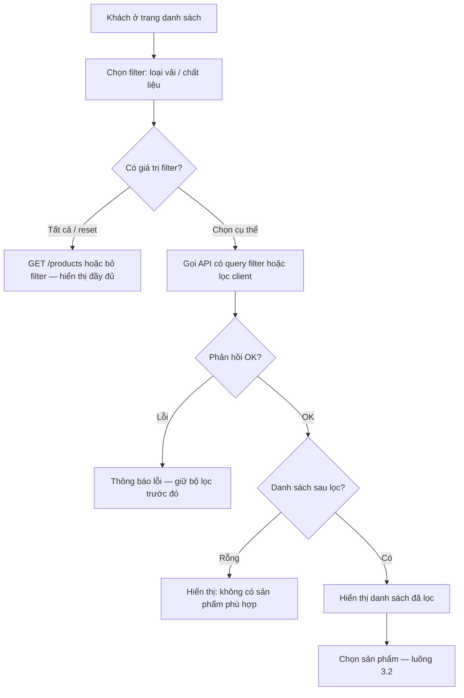

# 4.2 — Filter Products by Fabric Type Flow

Feature: Optional — Filter theo loại vải (PRD §4.3)

```mermaid
flowchart TD
    A[Khách ở trang danh sách] --> B[Chọn filter: loại vải / chất liệu]
    B --> C{Có giá trị filter?}
    C -->|Tất cả / reset| D[GET /products hoặc bỏ filter — hiển thị đầy đủ]
    C -->|Chọn cụ thể| E[Gọi API có query filter hoặc lọc client]
    E --> F{Phản hồi OK?}
    F -->|Lỗi| F1[Thông báo lỗi — giữ bộ lọc trước đó]
    F -->|OK| G{Danh sách sau lọc?}
    G -->|Rỗng| G1[Hiển thị: không có sản phẩm phù hợp]
    G -->|Có| H[Hiển thị danh sách đã lọc]
    H --> I[Chọn sản phẩm — luồng 3.2]
```
